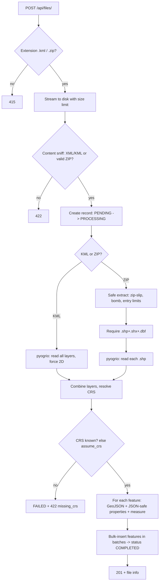

# Geospatial File Measurement API

A FastAPI backend that accepts a **KML** file or a **zipped Shapefile**, extracts every feature
(ID, geometry type, geometry, CRS, properties) and returns **CRS-aware measurements**:
polygon **area** and line **length** — never computed in raw latitude/longitude degrees.


- **Stack:** FastAPI · GeoPandas / pyogrio (GDAL) · Shapely 2 · PyProj · SQLAlchemy 2 (SQLite) · pytest
- **Interactive docs:** Swagger UI at `/docs`, ReDoc at `/redoc`, schema at `/openapi.json`
- **51 automated tests** covering measurements, CRS handling, validation and security edge cases, plus `ruff` linting in CI

---

## How I approached it

1. **Start from the hard requirement, not the framework.** The brief's real test is *"don't measure in degrees"*.
   So the measurement code is a pure, I/O-free module (`services/measurements.py`) that I could test against an
   independent ground truth (the WGS84 ellipsoid via `pyproj.Geod`) before any HTTP existed.
2. **Pick the right projection per question, not per file.** Area wants an *equal-area* projection, length wants a
   *conformal* one, and a file's own CRS may be neither (Web Mercator inflates area ~4x at 60°N). So each feature is
   re-projected to a local CRS chosen from its own location, and the geodesic value is returned as a cross-check.
3. **Treat every upload as hostile and every feature as fallible.** Zip-slip / zip-bomb / fake-extension checks guard
   the file; a per-feature `status` (`OK`, `NOT_APPLICABLE`, `UNSUPPORTED`, `FAILED`) means one weird geometry never
   sinks a 100k-feature file.
4. **Try to break it, then fix what breaks.** I ran probes (nested KML folders, Z coordinates, polygons with holes,
   a polygon over the antimeridian, a Polygon+Point `MultiGeometry`, 30k features) and fixed what they exposed — see
   [Learning](#learning).

---

## Table of contents
1. [Quick start](#quick-start) · 2. [API](#api) · 3. [Architecture](#architecture) · 4. [CRS handling](#crs-handling)
5. [Measurement logic](#measurement-logic) · 6. [Validation & errors](#validation--error-handling)
7. [Design decisions](#design-decisions) · 8. [Testing](#testing) · 9. [Configuration](#configuration)
10. [Learning](#learning) · 11. [Future scope](#future-scope) · 12. [Limitations](#known-limitations)

---

## Quick start

Requires Python 3.11+. The geospatial wheels bundle GDAL/GEOS/PROJ, so **no system packages are needed**.

```bash
git clone https://github.com/mukuldabas099/geofile-api.git
cd geofile-api

python -m venv .venv
source .venv/bin/activate          # Windows: .venv\Scripts\activate
pip install -r requirements.txt

uvicorn app.main:app --reload
```

Open **http://127.0.0.1:8000/docs** and try the upload endpoint with the files in `sample_data/`.

Docker alternative:

```bash
docker compose up --build        # or: docker build -t geofile-api . && docker run -p 8000:8000 geofile-api
```

With the server running, `make demo` uploads both sample files and prints the measurements
(`make test`, `make lint`, `make run` are also available).

Uploads and the SQLite database are stored under `./data/` (git-ignored).

---

## API

| Method | Path | Purpose |
|---|---|---|
| `POST` | `/api/files/` | Upload + validate + process a `.kml` or `.zip` (Shapefile) |
| `GET` | `/api/files/{id}/` | File info and processing status |
| `GET` | `/api/files/{id}/measurements/` | Per-feature measurements + summary (paginated) |
| `GET` | `/api/files/{id}/features/` | Extracted features: index, geometry type, geometry, CRS, properties (paginated) |
| `GET` | `/api/files/` | List uploaded files |
| `DELETE` | `/api/files/{id}/` | Delete a file, its features and the stored upload |
| `GET` | `/health` | Liveness probe |

Every path also works without the trailing slash (`/api/files/{id}`), so plain `curl` calls never hit a redirect.

### Upload

```bash
curl -F "file=@sample_data/sample.kml" http://localhost:8000/api/files/
```
```json
{
  "id": "a1ceeee4999e4996b2e8529999b75af5",
  "filename": "sample.kml",
  "file_type": "kml",
  "size_bytes": 1282,
  "feature_count": 4,
  "crs": "EPSG:4326",
  "status": "COMPLETED",
  "error_message": null,
  "created_at": "2026-10-07T08:00:29.188494Z",
  "completed_at": "2026-10-07T08:00:29.209422Z"
}
```

Shapefile (zip it with `.shp`, `.shx`, `.dbf`, `.prj`). If the `.prj` is missing, tell the API what to assume:

```bash
curl -F "file=@sample_data/parcels_utm43n.zip" http://localhost:8000/api/files/
curl -F "file=@noprj.zip" -F "assume_crs=EPSG:4326" http://localhost:8000/api/files/
```

### File information — `GET /api/files/{id}/`
Same shape as the upload response. `status` is one of `PENDING`, `PROCESSING`, `COMPLETED`, `FAILED`
(`error_message` explains a failure).

### Measurements — `GET /api/files/{id}/measurements/?limit=100&offset=0`

```json
{
  "file_id": "a1ceeee4999e4996b2e8529999b75af5",
  "crs": "EPSG:4326",
  "summary": {
    "total_features": 5, "measured": 3, "not_applicable": 1, "unsupported": 1, "failed": 0,
    "total_area_m2": 975594.027307223, "total_length_m": 1545.0698720338448
  },
  "limit": 100,
  "offset": 0,
  "items": [
    {
      "index": 0, "geometry_type": "Polygon", "status": "OK",
      "area_m2": 975594.027307223, "length_m": null,
      "projected_crs": "LAEA(lat_0=28.5, lon_0=77.0)",
      "method": "equal-area projection (Lambert Azimuthal Equal Area)",
      "geodesic_reference": 975594.0302352905, "geometry_repaired": false, "message": null
    },
    {
      "index": 1, "geometry_type": "LineString", "status": "OK",
      "area_m2": null, "length_m": 1397.2265887707124,
      "projected_crs": "EPSG:32643", "method": "UTM zone 43N",
      "geodesic_reference": 1396.9838828282318, "geometry_repaired": false, "message": null
    },
    {
      "index": 2, "geometry_type": "Point", "status": "NOT_APPLICABLE",
      "area_m2": null, "length_m": null, "projected_crs": null, "method": null,
      "geodesic_reference": null, "geometry_repaired": false,
      "message": "Points have no area or length"
    },
    {
      "index": 3, "geometry_type": "GeometryCollection", "status": "OK",
      "area_m2": null, "length_m": 147.84328326313235,
      "projected_crs": "EPSG:32643", "method": "UTM zone 43N",
      "geodesic_reference": 147.81794160070123, "geometry_repaired": false,
      "message": "Point parts have no measurement and were ignored"
    },
    {
      "index": 4, "geometry_type": "None", "status": "UNSUPPORTED",
      "area_m2": null, "length_m": null, "projected_crs": null, "method": null,
      "geodesic_reference": null, "geometry_repaired": false,
      "message": "Missing or empty geometry"
    }
  ]
}
```

`geodesic_reference` is an independent WGS84-ellipsoid value (m² or m) so you can see the projected result is
trustworthy (here: area within 0.0000003 %, length within 0.02 %). It is `null` for mixed point/line/polygon collections, where one number cannot describe both quantities.

### Features — `GET /api/files/{id}/features/`
Returns `index`, `geometry_type`, GeoJSON `geometry` (in the **source CRS**), `crs` and `properties` for each feature.

### Errors
All errors share one shape: `{"detail": "...", "code": "...", "file_id": null | "<id>"}`.

| HTTP | `code` | When |
|---|---|---|
| 413 | `file_too_large` | Upload exceeds `MAX_UPLOAD_MB` |
| 415 | `unsupported_file_type` | Extension is not `.kml` / `.zip` |
| 422 | `invalid_upload` / `invalid_archive` | Empty file, fake KML/ZIP, corrupt zip, no `.shp`, missing `.shx`/`.dbf`, unsafe zip paths, too many/too large entries |
| 422 | `unreadable_file` | GDAL cannot parse it (e.g. malformed XML) |
| 422 | `missing_crs` | No CRS declared and no `assume_crs` given |
| 422 | `no_features` / `too_many_features` | Zero features / above `MAX_FEATURES` |
| 404 | `not_found` | Unknown file id |
| 409 | `file_not_ready` | Results requested for a `FAILED`/unfinished file |

When processing fails after the file was accepted, the record is kept with `status=FAILED` and the
`file_id` is returned in the error so the failure stays inspectable via `GET /api/files/{id}/`.

---

## Architecture

```
app/
├── main.py              # app factory, exception handlers, wiring (settings, DB session factory)
├── config.py            # pydantic-settings (env / .env, GEOAPI_ prefix)
├── database.py          # engine + session factory (SQLite, WAL, FK on)
├── models.py            # UploadedFile, Feature (geometry + measurement columns)
├── schemas.py           # Pydantic response models -> OpenAPI
├── enums.py / exceptions.py
├── api/
│   ├── deps.py          # request-scoped DB session, settings
│   └── routes/files.py  # thin HTTP layer: no business logic
└── services/
    ├── storage.py       # filename sanitising, type detection, size-limited streaming, signature check
    ├── readers.py       # safe zip extraction, KML/Shapefile -> GeoDataFrame (+ KML boilerplate cleanup)
    ├── measurements.py  # CRS selection + area/length + geodesic cross-check (pure, DB-free)
    ├── processing.py    # pipeline orchestration, batched bulk INSERTs, status transitions
    └── files.py         # use-cases / queries used by routes
```

Layering: **routes → services → models**. `measurements.py` has no I/O and no framework imports, which is
why it is unit-tested directly with Shapely geometries.

### File-processing flow



Any failure after the record exists sets `status=FAILED` with a message instead of leaving it half-done.

### Measurement-calculation flow
1. Decompose the geometry into atoms (`Polygon`, `LineString`, `Point`); collections are flattened.
2. Repair invalid polygons with `shapely.make_valid` (flagged via `geometry_repaired`).
3. Transform source CRS → WGS84 lon/lat (vectorised); sanity-check coordinate ranges.
4. If the feature straddles the antimeridian, unwrap longitudes so it is contiguous.
5. Pick a projected CRS from the feature's own location (see below) and transform again.
6. `area` (polygon parts) and/or `length` (line parts) in metres; compute the geodesic reference.
7. Any exception is captured as `status=FAILED` on that one feature; the rest of the file is unaffected.

---

## CRS handling

> Degrees are angles, not distances. One degree of longitude is ~111 km at the equator but ~55 km at 60°N.

Every feature, regardless of the file's CRS, takes the same path:

```
source CRS ──► WGS84 (lon/lat) ──► local projected CRS (per feature) ──► measure in metres
```

| Measurement | Projected CRS | Why |
|---|---|---|
| **Area** | Lambert Azimuthal Equal Area centred on the feature (centre snapped to 0.5° for transformer caching) | Equal-area ⇒ area is preserved exactly, anywhere on Earth |
| **Length** | UTM zone of the feature centre (`EPSG:326xx` north / `EPSG:327xx` south) | Conformal, scale error < 0.1 % inside a zone |
| **Length, polar** (lat > 84° or < −80°) | Azimuthal equidistant centred on the feature | Outside UTM's valid band |

Why not just trust the file's own projected CRS? Because "projected" does not mean "accurate". Web Mercator
(EPSG:3857) inflates area ~4× at 60° latitude, and a UTM grid area differs from true ground area by the
scale factor (~0.08 % at the UTM zone-edge defaults). Re-deriving a suitable local CRS makes results
**ground-truth areas/lengths regardless of what the file arrived in**. Tests cover EPSG:4326, EPSG:32643 and EPSG:3857.

Axis order is handled with `always_xy=True` (lon/lat, x/y) everywhere to avoid the classic EPSG:4326 lat/lon swap bug.

**Antimeridian.** A polygon spanning Fiji has longitudes `179.9` and `-179.9`; naively that is a 359.8°-wide feature.
When a feature's longitude span exceeds 180° the western longitudes are shifted by +360° so it becomes contiguous, then
projected normally (tested against the ellipsoidal area to < 0.1 %). A feature that is still > 180° wide after
unwrapping is reported as `FAILED` rather than mis-measured.

---

## Measurement logic

| Geometry | Result | `status` |
|---|---|---|
| `Polygon`, `MultiPolygon` | `area_m2` (holes subtracted, parts summed) | `OK` |
| `LineString`, `MultiLineString`, `LinearRing` | `length_m` | `OK` |
| `Point`, `MultiPoint` | none | `NOT_APPLICABLE` |
| `GeometryCollection` (KML `MultiGeometry`) | polygon parts → `area_m2`, line parts → `length_m`, points ignored (noted in `message`); points only → `NOT_APPLICABLE` | `OK` |
| `null` / empty geometry (e.g. a Placemark with no geometry) | none + explanatory `message` | `UNSUPPORTED` |
| Transformation / range / > 180° span errors | none + error `message` | `FAILED` |

Unsupported geometries never fail the request; they are reported per feature. Self-intersecting polygons
are repaired before measuring and flagged (`geometry_repaired: true`). Z/M coordinates are dropped on read
(irrelevant to planar area/length).

---

## Validation & error handling

- **Type + content checks:** extension whitelist, then content sniffing (a renamed `.exe` is not accepted as `.kml`).
- **Size limit while streaming:** the upload is cut off at `MAX_UPLOAD_MB` without buffering it in memory.
- **Safe ZIP handling:** rejects absolute / `..` paths (zip-slip), encrypted archives, too many entries, and
  archives that expand beyond `MAX_UNCOMPRESSED_MB` (counted on real bytes, since headers can lie).
- **Filenames are display-only:** files are stored as `data/uploads/<uuid>/source.{kml,zip}`; client-supplied names never touch paths.
- **Completeness:** Shapefiles must have `.shp` + `.shx` + `.dbf`; a missing CRS requires explicit `assume_crs`.
- **Properties are JSON-safe and clean:** NaN/NaT/numpy/datetime values are normalised, and GDAL's unused KML boilerplate columns (`tessellate: -1`, `icon: null`, …) are dropped.
- **Consistent error contract** and a catch-all 500 handler that logs the traceback but never leaks it.

---

## Design decisions

| Decision | Chosen | Alternatives considered |
|---|---|---|
| Processing model | **Synchronous** inside the request (FastAPI runs sync endpoints in a threadpool). Status is still persisted so clients can treat it uniformly | Background task / Celery + Redis: right for very large files, but adds infra and polling for a payload that processes in milliseconds–seconds. The `status` field and layering make this a small change |
| Storage | **SQLite + SQLAlchemy 2** (original file kept on disk) | PostgreSQL/PostGIS: better for spatial queries and scale; unnecessary for a self-contained demo that must run with zero setup. SQLAlchemy keeps the swap to Postgres a config change (`GEOAPI_DATABASE_URL`) |
| Measure when stored | Computed **once at upload**, stored with the feature | Compute on every GET: wastes CPU and makes GET latency depend on file size |
| Mixed geometries | **Decompose** `GeometryCollection`: polygons → area, lines → length | Mark the whole collection unsupported (simpler, but silently discards a valid polygon that merely shares a Placemark with a point) |
| Throughput | **Vectorised** coordinate transforms (`shapely.transform` + NumPy) and **batched bulk INSERTs** | `shapely.ops.transform` (per-vertex Python loop) and per-row ORM objects: together they cut a 30k-feature upload from ~6.7 s to ~4.1 s in my profile |
| Area projection | **Per-feature equal-area (LAEA)** | One UTM zone per file (breaks for files spanning zones); geodesic-only (accurate, but the brief asks for projected CRS; kept as a cross-check instead) |
| Length projection | **Per-feature UTM** | LAEA (not distance-preserving); geodesic-only |
| GDAL access | **pyogrio** via GeoPandas | Fiona (older, slower, heavier). Both bundle GDAL wheels |
| Reading | KML: every layer (Folder) merged; Shapefile zip: every `.shp` merged (`_layer` property added when >1) | First layer only (silently loses data) |
| Config | `pydantic-settings`, app factory, state on `app.state` | Module globals (hard to test) |
| Errors | Domain exceptions → one JSON error shape | Raising `HTTPException` in services (couples them to HTTP) |
| Geometry storage | GeoJSON in the **source CRS** | Reprojecting everything to WGS84 (alters user data; source CRS is reported anyway) |

---

## Testing

```bash
pip install -r requirements-dev.txt
pytest -q
```

51 tests: area at multiple latitudes vs. geodesic ground truth, holes/multipolygons, projected & Web Mercator
sources, polar zone selection, antimeridian polygons/lines, mixed collections, invalid-geometry repair, end-to-end KML/Shapefile flows, pagination, and the
security / validation cases (zip-slip, fake files, oversize, missing `.prj`, malformed KML). CI runs on
Python 3.11 and 3.12 via GitHub Actions (lint + tests).

---

## Configuration

Environment variables (or `.env`, see `.env.example`):

| Variable | Default | Meaning |
|---|---|---|
| `GEOAPI_DATA_DIR` | `data` | Where uploads and the SQLite DB live |
| `GEOAPI_DATABASE_URL` | SQLite in data dir | Any SQLAlchemy URL |
| `GEOAPI_MAX_UPLOAD_MB` | 50 | Max upload size |
| `GEOAPI_MAX_UNCOMPRESSED_MB` | 250 | Zip-bomb guard |
| `GEOAPI_MAX_ZIP_ENTRIES` | 100 | Max files inside a zip |
| `GEOAPI_MAX_FEATURES` | 200000 | Max features per file |
| `GEOAPI_LOG_LEVEL` | INFO | Logging level |

---

## Learning

- **A projected CRS is not automatically a measuring CRS.** Equal-area for area and conformal for distance are
  different needs; picking the projection per measurement type was the key design insight.
- **GDAL/KML specifics:** KML is always WGS84, may contain multiple folders (layers) and 3-D coordinates, and
  `MultiGeometry` arrives as `GeometryCollection` — which is why graceful "unsupported" handling matters.
- **Untrusted archives are an attack surface** (zip-slip, zip bombs, lying headers); validating before parsing is cheap.
- **Pandas/NumPy scalars are not JSON** — NaN, NaT and int64 need explicit normalisation.
- **Validate numbers against an independent reference.** The geodesic cross-check exposed that pyproj's polygon
  area *adds* holes instead of subtracting them (found by a test), which I fixed by computing rings explicitly.
- Structuring the measurement code as a pure module made it trivial to test precisely.
- **Probing beats assuming.** A review pass with hostile inputs found real gaps that the happy-path tests had missed:
  antimeridian polygons failed, a `MultiGeometry` with one point discarded a valid polygon's area, KML properties were
  full of driver noise, timestamps lost their timezone after a round-trip through SQLite, and profiling showed half the
  upload time was Shapely's per-vertex Python fallback plus row-by-row ORM inserts. Each fix has a regression test.
- **"Unsupported" should be rare and honest.** Decomposing mixed geometries shrank it to genuinely unmeasurable
  input (missing geometry), which is what the status is for.

## Future scope

- Async processing with a job queue (Celery/RQ/arq) + progress and webhooks for very large files; streaming reads.
- PostgreSQL + **PostGIS** (spatial indexes, bbox / intersects queries) and Alembic migrations.
- **KMZ**, GeoJSON, GeoPackage and multi-layer selection; shapefile encodings (`.cpg`) options.
- Very-large-extent features (> 180° wide) and polygons enclosing a pole: use the geodesic value as primary.
- Multi-zone lines: when a line spans several UTM zones, switch the primary length to the geodesic value.
- More measurements: polygon perimeter, centroid, bounding box, vertex count, per-part breakdown of collections; unit options (ha, km², ft, mi).
- Authentication, per-user quotas, rate limiting, object storage (S3) for originals, and virus scanning.
- Observability: request IDs, structured logs, Prometheus metrics; load testing.
- Simple map viewer (Leaflet) over the `/features/` output.

## Known limitations

- Processing is synchronous; extremely large files will hold a worker thread until done.
- Features still spanning >180° of longitude after antimeridian unwrapping are reported as `FAILED` rather than mis-measured.
- Length accuracy for lines spanning several UTM zones is lower (use `geodesic_reference` if that matters).
- Encrypted ZIPs and KMZ are not supported.

## License
MIT
